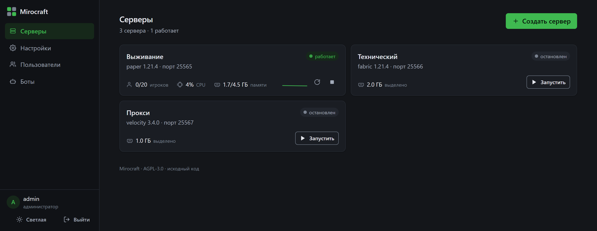
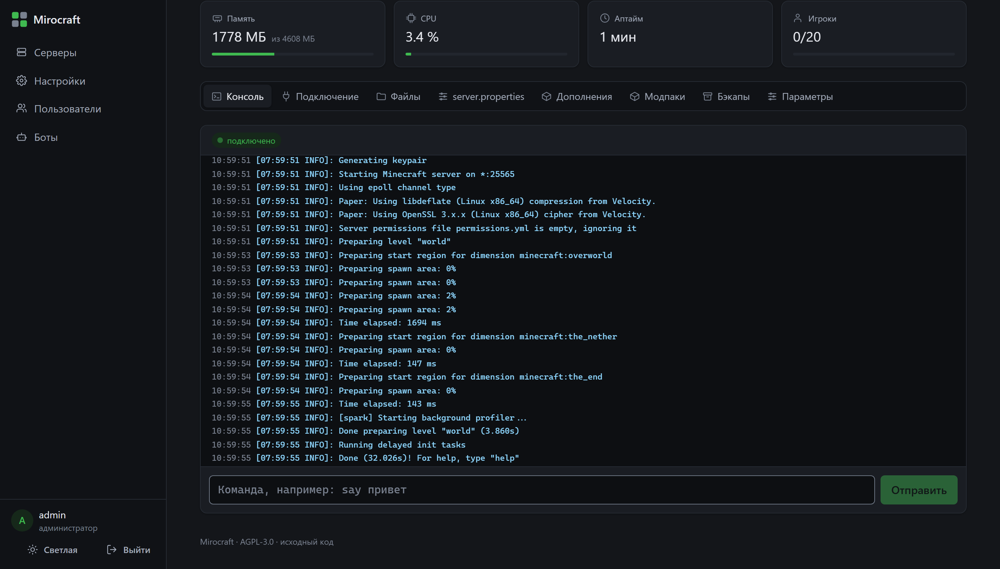
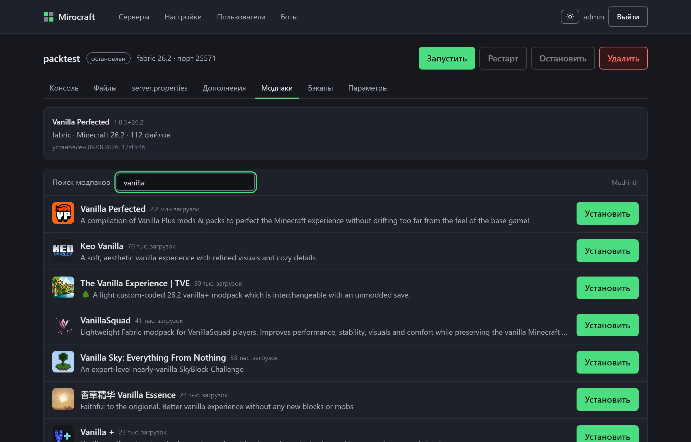
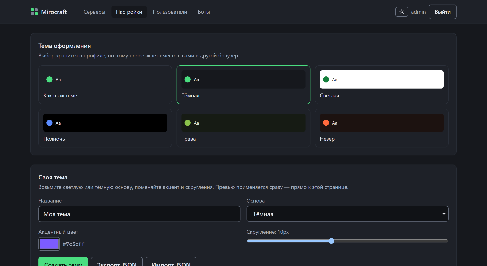

# Mirocraft

[](https://github.com/collybia/mirocraft/actions/workflows/ci.yml)
[](LICENSE)
[](go.mod)

**Панель управления Minecraft-серверами, которую ставят себе.** Как Aternos, только
сервер ваш: без очередей, без рекламы, без «сервер уснул, потому что никто не играл».

Один бинарник — это демон, REST API и веб-панель сразу. Ни nginx, ни MySQL, ни Redis,
ни отдельного агента на каждой машине.

[English](README.en.md) · [Документация](https://collybia.github.io/mirocraft/)

---

## Установка

**Ubuntu / Debian:**

```bash
curl -fsSL https://raw.githubusercontent.com/collybia/mirocraft/master/installer/install.sh | sudo bash
```

**Windows (PowerShell от администратора):**

```powershell
irm https://raw.githubusercontent.com/collybia/mirocraft/master/installer/install.ps1 | iex
```

Скрипт спросит, как панель будет доступна — бесплатный поддомен, свой домен, просто
по адресу или **только на этом компьютере** — и всё остальное сделает сам: пользователь,
служба, фаервол, сертификат.

Последний вариант — для домашней машины. Панель слушает `localhost`, поэтому не нужен ни
сертификат, ни предупреждение браузера, ни открытый порт. На серверы друзья при этом
заходят как обычно: их порты открываются отдельно, а какой адрес давать — панель говорит
на вкладке «Подключение».
В конце он печатает логин и пароль администратора; они же лежат в
`/var/lib/mirocraft/initial-admin.txt` (на Windows — в каталоге данных службы).

Повторный запуск того же скрипта — это обновление. Бинарник и служба переустанавливаются,
конфигурация, база и миры остаются на месте. Путь обновления и путь установки — один и тот
же код: иначе обновление становится тем путём, который никто не проверяет.

---

## Как это выглядит

| | |
|---|---|
|  |  |
| Серверы: ядро, порт, память, статус | Консоль по WebSocket, память, CPU, аптайм, игроки |
|  |  |
| Модпак в один клик — вместе с загрузчиком | Пять встроенных тем и редактор своих |

---

## Что умеет

**Серверы**

- 19 ядер: Vanilla, Paper, Purpur, Pufferfish, Folia, Fabric, Quilt, Forge, NeoForge,
  Sponge, Mohist, Arclight, Spigot (собирается через BuildTools с кэшем), прокси
  Velocity / BungeeCord / Waterfall и Bedrock: BDS, PowerNukkitX, PocketMine-MP.
- Версии подтягиваются от самих разработчиков ядра, а не из списка, который кто-то
  однажды переписал в код.
- Java и PHP нужной версии панель ставит себе сама. На хосте ничего ставить не нужно.
- Docker, если он есть; нативный запуск процессов, если его нет. Windows Server — через
  job objects, а не «как-нибудь».

**В один клик**

- **Модпаки** с Modrinth: панель скачает пак, поставит нужный загрузчик и нужную версию
  Minecraft, разложит моды и конфиги.
- **Плагины и моды** — поиск по Modrinth прямо в панели, с зависимостями и сверкой хэшей.
- **Кроссплей** — одна галочка ставит Geyser и Floodgate, и на Java-сервер заходят
  с Bedrock, без Java-аккаунта.

**Вокруг сервера**

- Консоль по WebSocket, файловый менеджер с редактором, `server.properties` с подсказками
  на человеческом языке.
- Бэкапы: по кнопке и по расписанию, восстановление и скачивание.
- Игроки: онлайн, кик, бан, whitelist, операторы.
- Планировщик: cron-задачи с цепочками действий (команда → бэкап → рестарт).
- DNS и TLS: бесплатный поддомен (deSEC / DuckDNS) или свой домен через Cloudflare,
  SRV-записи для Java, сертификат Let's Encrypt с автопродлением.

**Не только веб**

- **Discord- и Telegram-боты** из коробки: `/servers`, `/start`, `/stop`, `/status`,
  `/cmd`, `/console`. Токен вставляется в панели, отдельного процесса не нужно.
- **REST API** — не приложение к панели, а то, чем панель пользуется сама.
  OpenAPI-спека и Swagger UI на `/api/docs`.

---

## Чем отличается

|  | Mirocraft | Aternos | Pterodactyl |
|---|---|---|---|
| Где работает | ваш сервер | их серверы | ваш сервер |
| Очередь на запуск, засыпание | нет | есть | нет |
| Что нужно поставить | один бинарник | ничего | PHP, nginx, MySQL, Redis, Wings |
| Docker | по желанию | — | обязателен |
| Windows Server | поддерживается | — | нет |
| Модпаки | в один клик | в один клик | вручную |
| Кроссплей (Geyser) | галочка | вручную | вручную |
| Discord/Telegram-боты | встроены | нет | сторонние |
| Домен и TLS | настраивает установщик | их поддомен | настраиваете сами |
| Ограничения по железу | ваши | их тарифы | ваши |

Pterodactyl — зрелая панель для хостинг-провайдеров, и если у вас уже стоит стек под
неё, менять его незачем. Mirocraft для другого случая: одна VPS, один человек, и желание
поставить панель, а не собрать инфраструктуру вокруг неё.

---

## Не хочется возиться с VPS

Всё выше — про то, как поставить панель себе. Если сервер под неё арендовать не
хочется, [**MiroHost**](https://mirohost.tech) ставит Mirocraft за вас: панель уже
поднята, домен и сертификат настроены, платите за сервер и играете.

На функциональность самой панели это не влияет: это тот же код, что в этом
репозитории, и вы в любой момент можете съехать на свой сервер — данные
переносятся копированием каталога.

---

## Требования

- Linux x86-64 или ARM64 (Debian 11+, Ubuntu 20.04+), либо Windows Server 2019+.
- 2 ГБ RAM на панель и сам Minecraft-сервер сверху. Панель занимает десятки мегабайт;
  всё остальное — это Java.
- Порт для панели (по умолчанию 8080 или 443 с сертификатом) и порт на каждый сервер.
- Docker — по желанию. Установщик поставит его, если разрешите; без него панель запускает
  серверы процессами.

---

## Конфигурация

`/etc/mirocraft/mirocraft.yaml`, все ключи переопределяются переменными окружения
(`MIROCRAFT_ADDR`, `MIROCRAFT_DATA_DIR` и так далее). Пример со всеми полями и
комментариями — [`mirocraft.example.yaml`](mirocraft.example.yaml).

Данные — в `/var/lib/mirocraft`: SQLite-база, каталоги серверов, бэкапы, скачанные
рантаймы. Бэкап панели целиком — это копия этого каталога при остановленной службе.

---

## Из исходников

```bash
git clone https://github.com/collybia/mirocraft
cd mirocraft
make build          # бинарник под текущую ОС, с вшитой веб-панелью
make build-all      # linux/amd64, linux/arm64, windows/amd64
make test
make lint
```

Go 1.26+ и Node 22+ для сборки веб-панели. CGO не нужен нигде: SQLite — на
`modernc.org/sqlite`, поэтому кросс-компиляция работает без тулчейнов.

Установить собранный бинарник тем же скриптом, без скачивания релиза:

```bash
sudo MIROCRAFT_BINARY=./mirocraft bash installer/install.sh
```

---

## Документация

- [docs/API.md](docs/API.md) — все эндпоинты и почему они такие.
- [docs/API_GUIDE.md](docs/API_GUIDE.md) — быстрый старт с примерами curl.
- [docs/ARCHITECTURE.md](docs/ARCHITECTURE.md) — как устроено внутри.
- [docs/SECURITY.md](docs/SECURITY.md) — модель угроз, что защищено и как сообщить об уязвимости.
- [docs/ROADMAP.md](docs/ROADMAP.md) — что сделано и что нашлось при проверке.
- Живая спека — `/api/openapi.yaml`, Swagger UI — `/api/docs`.

---

## Лицензия

[AGPL-3.0](LICENSE). Ставьте, правьте, запускайте у себя — сколько угодно и без
условий. Условие одно и касается только тех, кто поднимает на этом коде **сервис
для других**: их правки тоже должны быть открыты. Тому, кто ставит панель себе,
AGPL не мешает ничем.

Название «Mirocraft» и логотип лицензией на код не покрываются.
